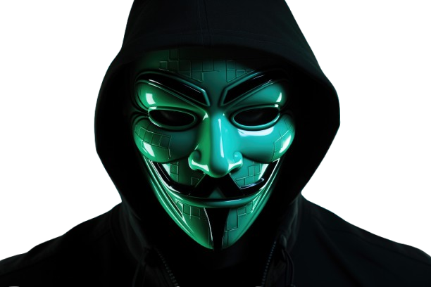

# 🚀 Interactive CLI Portfolio

> **"I tell people I'm a developer, and they believe me !!"** 😉

<div align="center">



[](https://reactjs.org/)
[](https://threejs.org/)
[](https://www.typescriptlang.org/)
[](https://vitejs.dev/)

</div>

---

## 🌌 Overview

Welcome to my **Interactive Portfolio**, a unique blend of retro-terminal aesthetics and modern 3D web technologies. This project isn't just a website; it's an experience. It features a fully functional **command-line interface (CLI)** for navigating my professional journey and a realistic **3D Identity Card** that interacts with your mouse movements.


## ✨ Key Features

### 🖥️ The Terminal
- **Retro Vibes**: Styled with CRT effects, scanlines, and a glowing green font.
- **Interactive Commands**: Type `help`, `about`, `projects`, and more to uncover details.
- **Hidden Gems**: Try finding the secret `sudo` command! 🔐

### 💳 The 3D ID Card
- **Physics-Based**: The card swings and reacts to your cursor, mimicking real-world physics using `react-three/rapier`.
- **Dynamic Textures**: Showcases my details, a QR code to my GitHub, and a custom logo.
- **Interactive**: <TAP the ID> to see it react!

### 🎨 Visual & Audio
- **Typewriter Effects**: Smooth, retro-style text animations.
- **Immersive Sound**: Subtle keyboard clicking sounds (optional implementation).
- **Responsive Design**: Adapts seamlessly from desktop monitors to mobile screens.

## 🛠️ Tech Stack

- **Frontend Core**: React, TypeScript, Vite
- **3D Engine**: `@react-three/fiber`, `@react-three/drei`
- **Physics**: `@react-three/rapier`
- **Styling**: Native CSS Variables (for that raw terminal look)
- **Deployment**: Vercel / GitHub Pages

## 🚀 Getting Started

Want to run this locally? Follow these steps:

### 1. Clone the Repository
```bash
git clone https://github.com/Shre-shth/portfolio-CLI.git
cd portfolio-CLI
```

### 2. Install Dependencies
```bash
npm install
```

### 3. Run Development Server
```bash
npm run dev
```
Open `http://localhost:5173` in your browser to enter the terminal.

## 📝 Customization

Make it yours! The project is structured for easy editing:

- **Personal Data**: Edit `src/terminal/data/commands.ts` to update your bio, projects, and skills.
- **Visuals**:
    - **ID Card**: Update `CardTexture.tsx` for layout changes.
    - **Images**: Replace assets in `public/images/` (keep names consistent or update paths).
    - **Styles**: Tweak `src/index.css` for color themes.

## 🤝 Contributing

Got a cool command idea or a visual improvement? PRs are welcome!

1. Fork the Project
2. Create your Feature Branch (`git checkout -b feature/AmazingFeature`)
3. Commit your Changes (`git commit -m 'Add some AmazingFeature'`)
4. Push to the Branch (`git push origin feature/AmazingFeature`)
5. Open a Pull Request

## 📄 License

Distributed under the MIT License. See `LICENSE` for more information.

---

<div align="center">

**Made with ❤️ and a lot of ☕ by Shreshth Vishwakarma**

[GitHub](https://github.com/Shre-shth) • [LinkedIn](https://www.linkedin.com/in/shreshth-vishwakarma/) • [Email](mailto:shreshth.vishwakarma.7@gmail.com)

</div>
